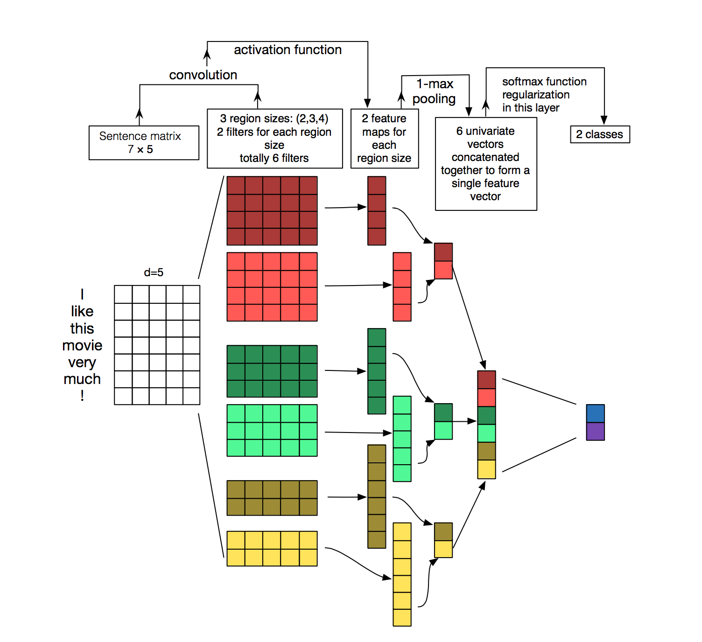

## CNN for Sentence Classification
- https://arxiv.org/pdf/1408.5882.pdf
- https://github.com/yunjey/pytorch-tutorial/blob/master/tutorials/01-basics/feedforward_neural_network/main.py
- https://github.com/yoonkim/CNN_sentence

### read bin (gensim)
- https://stackoverflow.com/questions/27324292/convert-word2vec-bin-file-to-text

### CNN
- https://wingnim.tistory.com/36
- https://blog.naver.com/rkdwnsdud555/221222217300
- https://www.evernote.com/shard/s473/client/snv?noteGuid=a5fa1301-5f63-49ea-a9a3-7e9b37b519da&noteKey=19439d5ced44368b&sn=https%3A%2F%2Fwww.evernote.com%2Fshard%2Fs473%2Fsh%2Fa5fa1301-5f63-49ea-a9a3-7e9b37b519da%2F19439d5ced44368b&title=Convolutional%2BNeural%2BNetworks%2Bfor%2BSentence%2BClassification

### CNN tensorflow
- https://ratsgo.github.io/natural%20language%20processing/2017/03/19/CNN/
- https://arclab.tistory.com/149

### CNN pytorch Conv1d
- https://github.com/taewanme/DL_With_PyTorch/blob/master/Chapter06/IMDB_with_1d_Convolutions_completed.ipynb

### CNN multi filters
- https://kh-kim.gitbook.io/natural-language-processing-with-pytorch/00-cover-7/05-cnn

